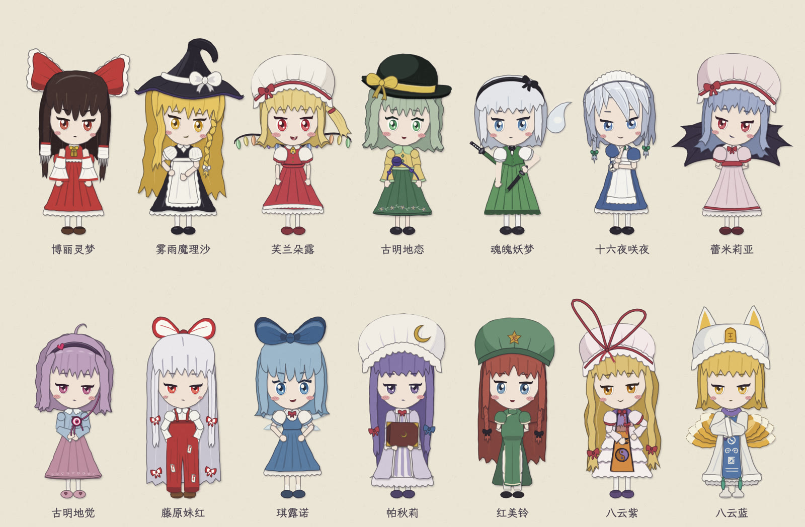

# 纯代码做一集东方视频 · Touhou, Drawn in Code · コードで描く東方

[](LICENSE)
[](https://fish2lab.github.io/touhou-code-video-template/film/)
[](#常见问题)
[](#给-ai-agent)

**中文**　一个开源模板：只用 JavaScript 和 Canvas 2D，做出一集有配音、有配乐的东方 Project 同人科普视频。画面里的每一笔都能追溯到一行代码：十四个 Q 版剪纸角色（2024–2026 年东方人气投票前十全员在内）、手写字、纸纹和投影都由程序生成，没有一张外部图片，也没有 AI 生图。每一帧只由时间 t 决定：可以跳到任意一秒，也可以把全片切开并行渲染，结果和从头顺序渲染一样。

**English**　An open-source template for making a fully voiced Touhou Project fan explainer video in nothing but JavaScript and Canvas 2D. Every stroke on screen traces back to a line of code: 14 paper-cut chibi characters (including every member of the 2024–2026 Touhou Popularity Poll top 10), handwriting, paper grain and shadows are all procedural — no image assets, no AI-generated art. Each frame is a pure function of time, so you can jump to any second or split the film across parallel renderers and get the same result as a straight run.

**日本語**　JavaScript と Canvas 2D だけで、ボイスと BGM 付きの東方Project 二次創作解説動画を一本作るためのオープンソーステンプレートです。画面の一筆一筆がコードの一行に対応します。14 人の切り絵風 SD キャラ（2024–2026 年の東方人気投票トップ 10 全員を含む）、手書き文字、紙の質感と影はすべてプログラムで生成され、画像素材も AI 生成画像も使っていません。各フレームは時刻 t だけで決まるので、任意の秒へ飛ぶことも、分割して並列レンダリングすることもでき、結果は頭から順に描いた場合と同じです。

**[介绍网页 / Project page](https://fish2lab.github.io/touhou-code-video-template/)** · **[92 秒演示片 / Demo film](https://fish2lab.github.io/touhou-code-video-template/film/)** · **[十个特效 / 10 effects](https://fish2lab.github.io/touhou-code-video-template/highlights/)** · [教程](docs/教程.md) · [经验](docs/经验.md) · [角色名单 / Cast](docs/角色名单.md) · [llms.txt](llms.txt)



出自「帕秋莉讲座」系列（[第 1 集](https://github.com/fish2lab/patchouli-lecture-1)、[第 2 集](https://github.com/fish2lab/patchouli-lecture-2)、[第 3 集](https://github.com/fish2lab/patchouli-lecture-3)）。本仓库把引擎、画具、角色和工具链抽出来，换成一段 80 秒的演示，讲的就是「这套东西怎么做」。

## 展望 · Outlook

**中文**　我们把这个仓库当成两件事的试验台。

在艺术这一边，它是一种用代码当画笔的同人创作。剪纸的折角、手绘线的呼吸、八音盒改编的角色曲，都是可以读、可以改、可以重新组合的规则。一位画师的风格从此可以写成一份部件表，像乐谱一样被别人演奏。

在研究这一边，它是一个可复现的视觉程序语料。画面完全确定，所以「模型写的动画好不好」可以落到具体的帧、具体的行；角色有统一规格和样张页，所以可以拿来考察编码 agent 的视觉程序合成、长任务规划和多 agent 并行协作。这个仓库本身就是人和多个 AI agent 一起写的，流程和规则都写在 AGENTS.md 里。

接下来的方向：补齐人气投票 11–16 名的角色；日文和英文配音；让 agent 从一份方案文档独立做完一整集；把每个角色的样张和规格整理成可以引用的数据集。

**English**　We treat this repository as a testbed for two things. As art, it is fan creation with code as the brush: the folds of cut paper, the breathing of hand-drawn lines, music-box arrangements of character themes are all rules you can read, change and recombine, so an illustrator's style becomes a parts table that others can perform like a score. As research, it is a corpus of reproducible visual programs: rendering is fully deterministic, so judging an animation written by a model comes down to specific frames and specific lines, and the shared character spec and contact sheets make it a natural setting for studying visual program synthesis, long-horizon planning and multi-agent collaboration by coding agents. The repository itself was built by a human working with several AI agents in parallel; the workflow lives in AGENTS.md. Next: the poll's ranks 11–16, Japanese and English voice-over, agents producing a full episode from a single plan document, and a citable dataset of character sheets and specs.

**日本語**　このリポジトリは二つの実験場です。アートとしては、コードを筆にした二次創作です。切り紙の角、手描き線の揺らぎ、オルゴール編曲のキャラテーマはどれも読んで書き換えられる規則なので、絵描きの画風を部品表として書き残し、楽譜のように他の人が演奏できます。研究としては、再現可能な視覚プログラムのコーパスです。描画は完全に決定的なので、モデルが書いたアニメーションの良し悪しを特定のフレームと行に落とし込めます。統一されたキャラ規格とサンプルシートは、コーディングエージェントによる視覚プログラム合成、長期タスクの計画、複数エージェントの並列協調を調べる題材になります。このリポジトリ自体も、人と複数の AI エージェントが並行して作りました。次の目標は、人気投票 11–16 位のキャラ、日本語・英語ボイス、計画書一枚からエージェントが一話を作り切ること、そして引用可能なキャラシート・データセットです。

学术引用见 [`CITATION.cff`](CITATION.cff)（GitHub 右栏「Cite this repository」）。

## 快速开始

需要 Node.js 20+、ffmpeg（出片和配音要用）。

```sh
npm install && npm run font     # 装依赖，下载字体
open index.html                 # 浏览器直接看；?scene=time 只放一段；空格暂停，←/→ 跳 5 秒
```

```sh
node tools/frames.mjs --grid 24          # 抽全片联系表 → out/frames/film-grid.jpg
node tools/overlap.mjs --scene time      # 穿模检查
npm run build                            # 单文件网页 → dist/index.html
npm run voice                            # 改了台词后重新合成配音（要提交 src/voice-data.js）
npm run bgm -- 角色曲.mid                 # 换 BGM：从扒谱取音符（要提交 src/bgm-data.js），见教程「背景音乐」
npm run render                           # 出片 → out/*.mp4
```

第一次跑 Playwright 需要浏览器：`npx playwright install --with-deps chromium`（Linux 服务器上），或者设 `CHROMIUM=/usr/bin/chromium` 用系统自带的。

## 读什么

1. [`docs/教程.md`](docs/教程.md)：给「没碰过这条管线」的人。核心思想「画面 = f(t)」、文件地图、一段怎么写、配音、开发循环、出片原理、常见坑。
2. [`docs/经验.md`](docs/经验.md)：什么让一集耐看，以及第 2、3 集为什么显得单调、怎么避免。
3. [`AGENTS.md`](AGENTS.md)：开新一集的流程和规则。让 AI agent 接手时先让它读这个。
4. [`src/scenes/_scene-template.js`](src/scenes/_scene-template.js)：新段的起手文件。
5. `docs/方案.md`、`分镜.md`、`施工.md`、`发布.md`：每一集要先写的文档模板。

## 给 AI agent

**中文 / English / 日本語**：这一节写给 Claude Code、Codex、Cursor、Copilot、Gemini CLI 等编码 agent。/ For coding agents. / コーディングエージェント向け。

1. 先读 [`AGENTS.md`](AGENTS.md)（流程和硬规则），再读 [`llms.txt`](llms.txt)（项目摘要和文档索引）。
2. 硬规则：画面是时间的纯函数；不用 `Math.random()`，用 `hash` / `rng`；逐帧绘制里不用 `c.filter`；每个脚本的顶层名字带自己的前缀（全部脚本共用一个全局作用域）。
3. 调用一个角色：`drawReimu(c, {{ x, y, h: 500, pose: 'gohei', mood: 'smug', t }})`，返回 `head`、`hands` 等锚点，用来摆道具。每个角色文件的文件头有完整参数表，id 列表见 [`docs/角色名单.md`](docs/角色名单.md)。
4. 加一个角色：照 [`docs/rig.md`](docs/rig.md)「加一个角色」四步。
5. 便宜的验收：`node tools/sheet.mjs --who <id>`，截出姿势表和表情表，有页面报错时退出码为 1；`node tools/frames.mjs --scene <段名> --grid 24` 抽帧看图。不需要开浏览器，也不用渲染整片。
6. 并行施工：每段、每个角色一个文件，一个 git worktree，文件所有权不重叠，最后由主会话合并。

## 目录

```
index.html            页面骨架
src/core.js           逐帧引擎、播放器、声音、台词排布
src/kit.js            画具（剪纸、手绘线、手写字、魔导书舞台…）
src/rig.js            剪纸人偶引擎（数据驱动，除帕秋莉、琪露诺外的十二位都用它，说明见 docs/rig.md）
src/character/        十四个剪纸角色：帕秋莉、琪露诺、八云蓝、八云紫、红美铃、蕾米莉亚、古明地觉，以及按人气投票补的灵梦、魔理沙、芙兰朵露、古明地恋、妖梦、咲夜、妹红（名单和依据见 docs/角色名单.md；八云紫文件里还有缝隙道具 drawYukariGap）
character.html        角色样张页：?who=ran&sheet=poses 看姿势表，sheet=moods 看表情表
tools/sheet.mjs       样张截图（没有图形界面时用）：node tools/sheet.mjs --who yukari → out/sheets/
fx.html               亮点特效画廊：?fx=nap-fall&t=3.5 看某个特效的某一秒
src/fx/               10 个从第 1–5 集提炼的独立特效模块（头注释写了出处、好在哪、复用、分叉），总览见 docs/亮点.html；挂进一集：index.html 加 _fx.js 和模块，fxScene / fxPlay 一行调用（见 _fx.js 头注释）
tools/fxcheck.mjs     特效联系表：node tools/fxcheck.mjs <id> --n 12 → out/fx/<id>.jpg，页面有报错时退出码为 1
tools/fxrender.mjs    把一个特效渲染成无声短视频：node tools/fxrender.mjs nap-fall → out/fx/nap-fall.mp4
site/                 介绍网页（单栏极简）和它用的短视频、帧条，Pages 部署时和 film/、highlights/ 拼成站点
src/props.js          共用站位和道具
src/scenes/           每段一个文件（现在是五段演示）
src/film.js           时间线、字幕、翻页转场
src/bgm-data.js       背景音乐的音符（tools/bgm.mjs 从角色曲扒谱里取，core.js 的 score() 编配；现在是帕秋莉的「ラクトガール ～ 少女密室」）
tools/                抽帧、穿模检查、打包、配音、出片
docs/                 教程、经验、各类文档模板
```

## 常见问题

**完全不用图片吗？** 是。角色、背景、字、特效都是 `src/` 里的 Canvas 代码画的；仓库里的位图只有介绍网页和特效总览用的截图、短视频。

**为什么选这十四个角色？** 帕秋莉、琪露诺、红美铃、蕾米莉亚、八云紫、八云蓝、古明地觉来自「帕秋莉讲座」前几集；其余七位是 2024、2025、2026 年三届「東方Project人気投票」人妖部门前十的并集里还没有的角色。名次和出处见 [`docs/角色名单.md`](docs/角色名单.md)。

**能做什么题材？** 任何几分钟的讲解视频。演示片讲的是这套工具本身；系列前三集讲的是大学生的身体调理、学习的预测误差模型、信息论和记忆。换 `src/scenes/` 里的几段文件就是一集新的。

**要会画画吗？** 不用。要会一点 JavaScript。新角色照 `docs/rig.md` 复制一个部件表改颜色和轮廓；新画面照 `src/scenes/_scene-template.js` 写。

**能交给 AI agent 写吗？** 能，这个仓库本身就是这样做的。让 agent 先读 [`AGENTS.md`](AGENTS.md)；给 AI 读的项目摘要在 [`llms.txt`](llms.txt)。

**渲染要多久？** 92 秒的演示片在 4 核云端机器上开 3 个并行页面约 135 秒。

**可以拿去发 B 站 / YouTube / ニコニコ吗？** 代码是 MIT。成片是东方 Project 二次创作，请遵守官方二次创作指南，并在简介注明 AquesTalk 和原曲出处（见下面「许可」）。

## 许可

- 代码：MIT。
- 字体：霞鹜文楷（SIL Open Font License，`fonts/LXGWWenKai-OFL.txt`）。`npm run font` 会下载，不进仓库。
- 语音：AquesTalk（© 株式会社アクエスト），经 [aquestalk.js](https://github.com/y52en/aquestalk.js) 合成；仓库里只有合成出的声音，不含 AquesTalk 本体。发布成片请在片尾或简介注明「AquesTalk（株式会社アクエスト）」。拼音→假名表来自 [yukumo-js](https://github.com/yukumo-group/yukumo-js)（MIT）。
- 背景音乐：东方红魔乡「ラクトガール ～ 少女密室」（ZUN）的代码改编，音符取自 [touhou-midi-collection](https://github.com/AyHa1810/touhou-midi-collection) 里的 ZUN 原版 MIDI；仓库里只有挑出的音符和我们的编配，不含 MIDI 文件。
- 东方 Project 的角色版权归上海爱丽丝幻乐团（ZUN）。使用本模板做的是同人作品，请遵守东方 Project 官方的二次创作指南。
